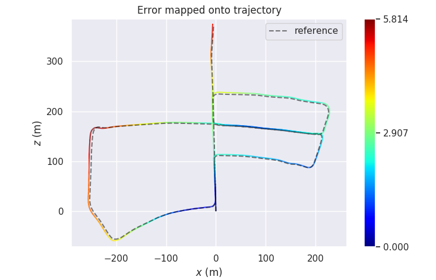

# lightweight_slam

This is a light weight but complete SLAM framework，There are mainly 5 modules

+ Tracking: use optical flow to track (include stereo match with right image)

+ Optimizing: fused map point and optimize local map with G2O

+ Loop Closure: use DBow3 find, verify by match descriptors and optimize Pose Graph

+ Viewer: use pangolin display trajectory, point cloud and image

+ Map: use 2d Delaunay triangle back project to generate 3D Mesh represent (unfinished) 

each module can be easily opened or closed

## Result

+ APE w.r.t. translation part (m)
  (not aligned)

       max	5.814456
      mean	2.589880
    median	2.345237
       min	0.000000
      rmse	2.897114
       sse	23173.811510
       std	1.298379

+ light-weight

  track keyframe: about 13ms

  track frame: about 3ms

  Easily handle high speed movement scenes more than 60-90Hz

## Run it

​	To run the demo, You need install  ROS, Eigen3, Sophus, OpenCV, G2O, DBow, Pangolin, and GLOG.

​	You can put the directory in `catkin_ws/src`, and run `catkin_make` to compile

​	You can edit parameters in `./config/kitti.yaml`

​	Run `rosrun light_weight_slam lightweight_slam` to run this demo

​	Then run `evo_ape kitti path/to/ground_truth path/to/output/CameraTrajectory.txt -vp --plot_mode=xz`

> `path/to/output` can find in `./config/kitti.yaml`

## Framework
